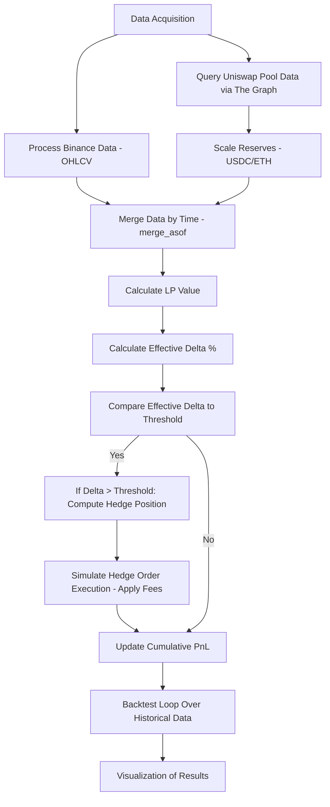
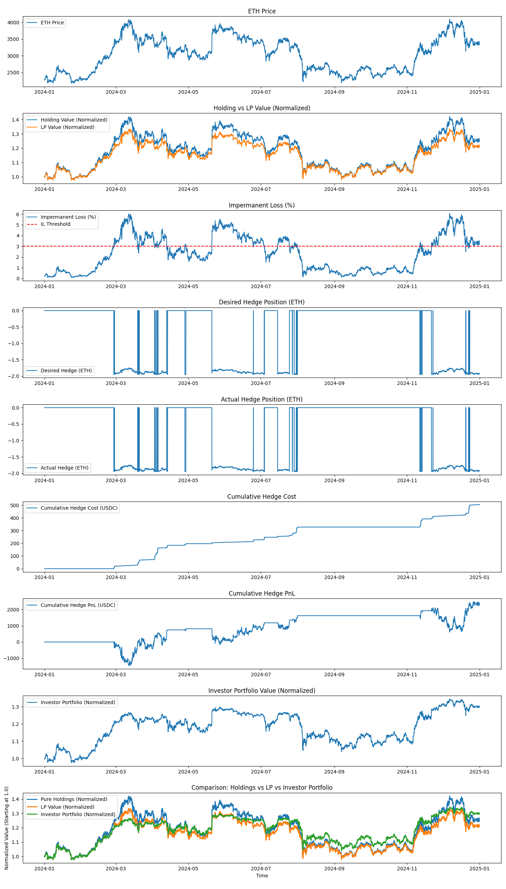
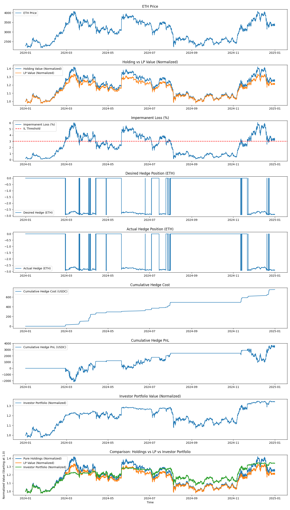
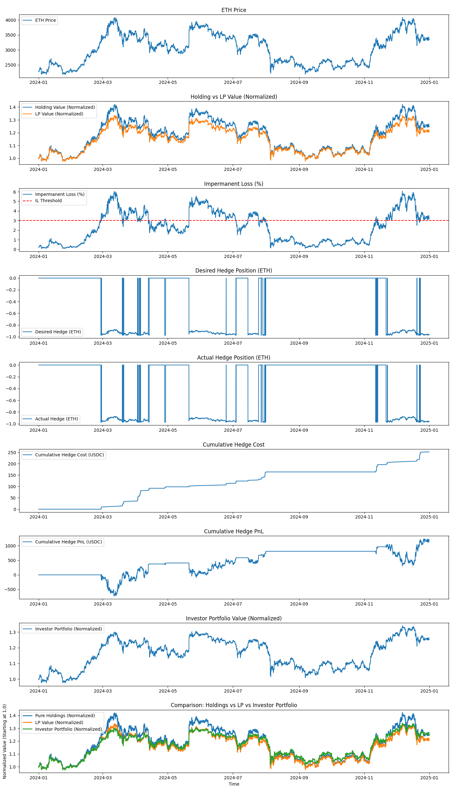
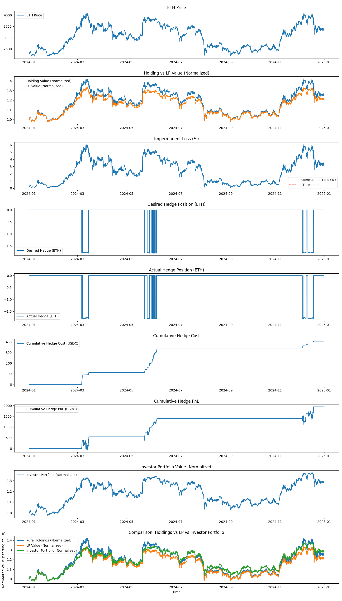
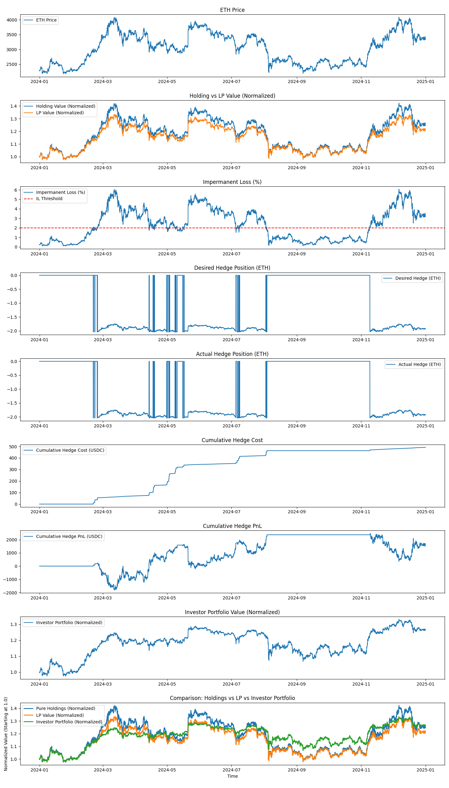

# Hedging Impermanent Loss Trading Bot

This repository contains a trading bot that hedges impermanent loss in a Uniswap V2 ETH/USDC pool using perpetual contracts on Binance. The bot collects historical data, calculates the Liquidity Provider (LP) position value, determines the sensitivity (Effective Delta) of the position to ETH price changes, and simulates hedging orders when necessary. A backtest of the strategy is included along with detailed visualizations of key performance metrics.

---

## Table of Contents

- [Overview](#overview)
- [High-Level Logic Description](#high-level-logic-description)
  - [Formulas and Calculations](#formulas-and-calculations)
  - [Handling Market Nuances](#handling-market-nuances)
- [Workflow Diagram](#workflow-diagram)
- [Files Included](#files-included)
- [Setup and Installation](#setup-and-installation)
- [Usage](#usage)
- [Results and Analysis](#results-and-analysis)
- [Parameter Sensitivity Analysis](#parameter-sensitivity-analysis)
- [License](#license)

---

## Overview

The goal of this project is to mitigate the impermanent loss that liquidity providers face by dynamically hedging their position using Binance perpetual contracts. The bot performs the following steps:

- Retrieves historical OHLCV data for the ETH/USDC pair from Binance using the `ccxt` library.
- Collects pool reserve data from a Uniswap V2 pool via The Graph API.
- Synchronizes the data using time-based merging (`pd.merge_asof`).
- Calculates the LP position value, the holding value, and the impermanent loss.
- Determines the Effective Delta of the position and triggers a hedging order when the impermanent loss exceeds a preset threshold.
- Simulates the execution of hedging orders, including fee calculations.
- Backtests the strategy over historical data and generates visualizations for analysis.

---

## High-Level Logic Description

### Objective

Hedge the impermanent loss in a Uniswap V2 ETH/USDC liquidity pool using Binance perpetual contracts, thereby reducing portfolio volatility and achieving higher end-of-year returns compared to simply holding the assets or maintaining an unhedged LP position.

### Functional Blocks

1. **Data Acquisition**

   - **Binance Data:** Retrieve historical candlestick (OHLCV) data for the ETH/USDC pair using the `ccxt` library.
   - **Uniswap Pool Data:** Query The Graph API to obtain historical pool state data (ETH and USDC reserves) with pagination.

2. **Data Processing and Integration**

   - Synchronize the two data sources using `pd.merge_asof` so that the most recent available ETH price is paired with the corresponding pool state.
   - Convert and scale the raw data (e.g., adjusting token decimals for USDC and ETH) to reflect real-world values.

3. **LP Value and Holding Value Calculations**

   - **LP Value:**  
     We use the following simplified formula for a 50/50 pool:

     

     where:

     - \( K \) is the constant product of the reserves (e.g., for 5 ETH and 10,000 USDC, \( K = 50000 \)),
     - \( P \) is the current price of ETH.

- **Holding Value:**  
  For a position that simply holds a fixed amount of ETH and USDC:

  +\text{USDC&space;amount}>)

  For example, with 5 ETH and 10,000 USDC:

  

4. **Impermanent Loss Calculation**

   - **Absolute Impermanent Loss:**

     

   - **Impermanent Loss Percentage:**

     

5. **Effective Delta and Hedging Decision**

   - **Effective Delta / Exposure Calculation:**

     The current ETH exposure in the LP position is approximated by:

     

     This value represents the quantity of ETH in the LP.

   - **Hedging Signal:**

     When the impermanent loss percentage exceeds a preset threshold (`IL_THRESHOLD`), the desired hedge position is computed as:

     

     where  (e.g., 0.5) is the hedging coefficient that determines the fraction of the ETH exposure to hedge.

6. **Hedging Simulation**

   - **Order Execution and Fees:**  
     The change in hedge position is calculated at each time step:

     

     The fee incurred for changing the position is:

     

   - **Hedge PnL Calculation:**  
     For a short hedge, the profit/loss is calculated as:

     )

   - **Investor Portfolio:**  
     The final portfolio value is computed as:

     

     Results are normalized relative to the initial holding value for easier comparison.

---

### Handling Market Nuances

In real-world crypto markets, several factors can affect the performance of a hedging strategy. In this simulation, the following assumptions and simplifications have been made:

- **Slippage and Liquidity:**  
  The simulation assumes instantaneous execution at the last known price. In a live trading environment, slippage—the difference between expected and actual execution prices—can occur, especially during periods of high volatility.

- **Order Book Impact:**  
  The model does not account for the market impact of large orders. For substantial trading volumes, the execution of orders may influence the market price and alter liquidity conditions.

- **Volatility and Market Shocks:**  
  Sudden price swings and market shocks can lead to unexpected losses. Stress-testing the strategy under various historical volatility conditions and considering adaptive mechanisms (such as dynamic adjustments to \(\alpha\) or \(IL\%\) thresholds) is recommended.

- **API Delays and Errors:**  
  When retrieving data from exchanges and APIs (Binance, The Graph), there may be delays, connectivity issues, or rate-limit restrictions. In a production environment, robust error handling, retries, and data caching mechanisms are essential.

These nuances should be carefully considered when transitioning from simulation to a live trading environment to minimize risks and ensure the robustness of the strategy.

---

## Workflow Diagram

Below is the workflow diagram outlining the major steps of the trading bot:



## Files Included

- **src/** – Contains all the source code:
  - **config.py** – Configuration constants (e.g., FEE_RATE, IL_THRESHOLD, ALPHA, INITIAL_K, pool address, etc.).
  - **data_fetcher.py** – Functions to fetch data from Binance (OHLCV) and The Graph (pool data).
  - **calculations.py** – Functions to compute LP Value, Holding Value, and impermanent loss.
  - **plotting.py** – Functions to generate the visualizations.
  - **simulation.py** – Logic for backtesting the strategy, including position calculations, fee assessments, and PnL.
  - **main.py** – The main entry point for running the simulation.
- **data/** – Directory for saving CSV files with raw data and backtest results (e.g., eth_candles.csv, uniswap_pool_data.csv, backtest_results.csv).
- **images/** – Contains supplementary images (sample output screenshot `final_output.png`).
- **README.md** – This file.
- **requirements.txt** – List of Python package dependencies.
- **.gitignore** – Specifies files/folders to ignore (e.g., virtual environments, temporary files).

## Setup and Installation

1. **Clone the Repository:**

   ```bash
   git clone https://github.com/TacitusXI/defi-il-hedge-bot.git
   cd defi-il-hedge-bot
   ```

2. **Create a Virtual Environment (Optional but Recommended)**
   **On macOS/Linux:**

   ```bash
   python -m venv venv
   source venv/bin/activate

   ```

   **On Windows:**

   ```bash
   python -m venv venv
   venv\Scripts\activate


   ```

3. **Install Dependencies**

   ```bash
   pip install -r requirements.txt


   ```

## Usage

**To run the trading bot and backtest the strategy, execute the following command from the repository root:**

```bash
python -m src.main

```

This command will:

- Fetch Binance candlestick and Uniswap pool data.
- Save raw data to the data/ folder.
- Run the backtest simulation with the hedging strategy.
- Generate and display plots.
- Save the final backtest results to data/backtest_results.csv.

## Results and Analysis

**To run the trading bot and backtest the strategy, execute the following command from the repository root:**

Once the simulation completes, you will see several plots displayed, including:

- ETH Price Over Time
- Normalized LP vs. Holding Value
- Effective Delta (%)
- Hedge Position and Cumulative Hedge PnL
- A sample output of the final combined chart is shown below:

The CSV file data/backtest_results.csv will contain detailed metrics for further analysis.

### Parameter Sensitivity Analysis

In addition to the baseline scenario (using, for example, `ALPHA = 0.5` and `IL_THRESHOLD = 3.0`), the strategy can be fine-tuned by varying key parameters. The following scenarios illustrate how adjustments to the hedging coefficient (`ALPHA`) and the impermanent loss trigger threshold (`IL_THRESHOLD`) can impact performance:

#### 1. Baseline Scenario

- **Parameters:** `ALPHA = 0.5`, `IL_THRESHOLD = 3.0`
- **Outcome:**  
  This scenario represents the default settings used in the simulation. The hedging actions are triggered when the impermanent loss exceeds 3%, and 50% of the LP’s ETH exposure is hedged. Backtesting shows that this approach achieves a balance between mitigating impermanent loss and limiting trading costs, resulting in a portfolio that outperforms both a simple holding strategy and an unhedged LP position while reducing overall volatility.
  

#### 2. Aggressive Hedging

- **Parameters:** `ALPHA = 0.75`, `IL_THRESHOLD = 3.0`
- **Outcome:**  
  Increasing `ALPHA` to 0.75 means that a larger fraction of the ETH exposure is hedged once the trigger threshold is reached. This aggressive hedging can further reduce the portfolio’s volatility by more effectively counteracting adverse price movements. However, the increased frequency and magnitude of hedge adjustments may lead to higher trading costs, which could slightly diminish net returns if fees become significant.
  

#### 3. Conservative Hedging

- **Parameters:** `ALPHA = 0.25`, `IL_THRESHOLD = 3.0`
- **Outcome:**  
  Lowering `ALPHA` to 0.25 results in a more conservative approach, hedging only 25% of the ETH exposure when the impermanent loss exceeds the threshold. This reduces trading costs due to fewer and smaller hedge adjustments but may leave the portfolio more exposed to adverse price movements, leading to higher overall volatility and potentially larger impermanent losses.
  

#### 4. Early Hedging Trigger

- **Parameters:** `ALPHA = 0.5`, `IL_THRESHOLD = 2.0`
- **Outcome:**  
  By decreasing the threshold to 2.0%, hedging actions are initiated earlier, potentially mitigating impermanent loss more proactively. This approach tends to result in more frequent hedging adjustments. While early hedging may protect the portfolio from even modest adverse moves, the increased activity can raise trading costs, which must be weighed against the benefits of reduced exposure.
  

#### 5. Delayed Hedging Trigger

- **Parameters:** `ALPHA = 0.5`, `IL_THRESHOLD = 5.0`
- **Outcome:**  
  Increasing the threshold to 5.0% delays the hedging trigger. In this scenario, the LP position remains unhedged for a longer period, which may reduce trading costs due to less frequent hedge adjustments. However, this also means that the portfolio is exposed to larger swings in impermanent loss before hedging occurs. The strategy may yield higher returns during stable market conditions but could incur significant losses during rapid adverse moves.
  

##### Comparative Metrics

For each scenario, key performance metrics can be analyzed to assess the trade-offs:

- **Final Portfolio Value:** Normalized relative to the initial holding value.
- **Cumulative Hedge PnL:** Total profit/loss generated from the hedging actions.
- **Total Trading Costs:** Sum of all fees incurred during hedge adjustments.
- **Portfolio Volatility:** Standard deviation of portfolio returns over the backtest period.

By comparing these metrics across scenarios, users can identify the optimal balance between risk mitigation (lower volatility and impermanent loss) and trading costs. This sensitivity analysis enables fine-tuning the strategy to better suit different market conditions and individual risk preferences.

_Note:_ Data backtested based on the full 2024 year. The simulation code allows you to adjust `ALPHA` and `IL_THRESHOLD` via the configuration file (`config.py`). We encourage users to experiment with different parameter values and analyze their impact on the strategy’s performance using the generated backtest reports and visualizations.

## License

**This project is licensed under the MIT License.**

##

Note:
It is recommended to further test and adapt the strategy under real market conditions to minimize risks and optimize performance. It is also essential to account for market nuances such as slippage, market impact, API delays, and sudden volatility spikes.
